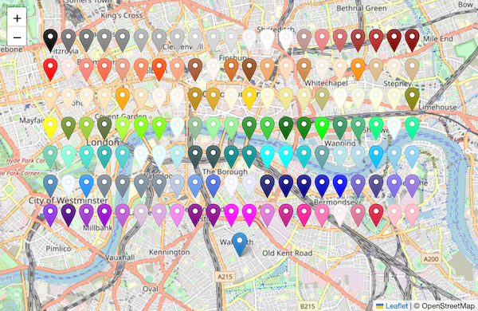

# leaflet-color-marker
Color Marker Icons for Leaflet

# Usage

    import { colorIcon } from './color_icon.js';

    // Leafet Quick Start Guide
    var map = L.map('map').setView([51.505, -0.09], 13);
    L.tileLayer('https://tile.openstreetmap.org/{z}/{x}/{y}.png', {
        maxZoom: 19,
        attribution: '© OpenStreetMap'
    }).addTo(map);

    // Color Icons for Markers
    var marker = L.marker([51.5050, -0.090], { icon: colorIcon('royalblue') }).bindTooltip('royalblue').addTo(map);
    var marker = L.marker([51.5050, -0.085], { icon: colorIcon('#4169E1')   }).bindTooltip('#4169E1').addTo(map);

# Examples

See [simple](simple.html) for a full but simple example and [example](example.html) for a view of how named css colors appear on a marker

# API

The single, exported function `colorIcon()` takes a single argument, either the name of a CSS color or a `#rrggbb` color hex code.  It returns a [L.divIcon](https://leafletjs.com/reference.html#divicon) with an SVG that looks like the Leaflet [Marker](https://leafletjs.com/reference.html#marker) icon.

# History

This originated from work on the [Zeldamod's objmap](https://objmap.zeldamods.org) where we needed icons that could change color. 

The code is mostly the SVG shape and some color manipulation functions.

# License
BSD 2-Clause

